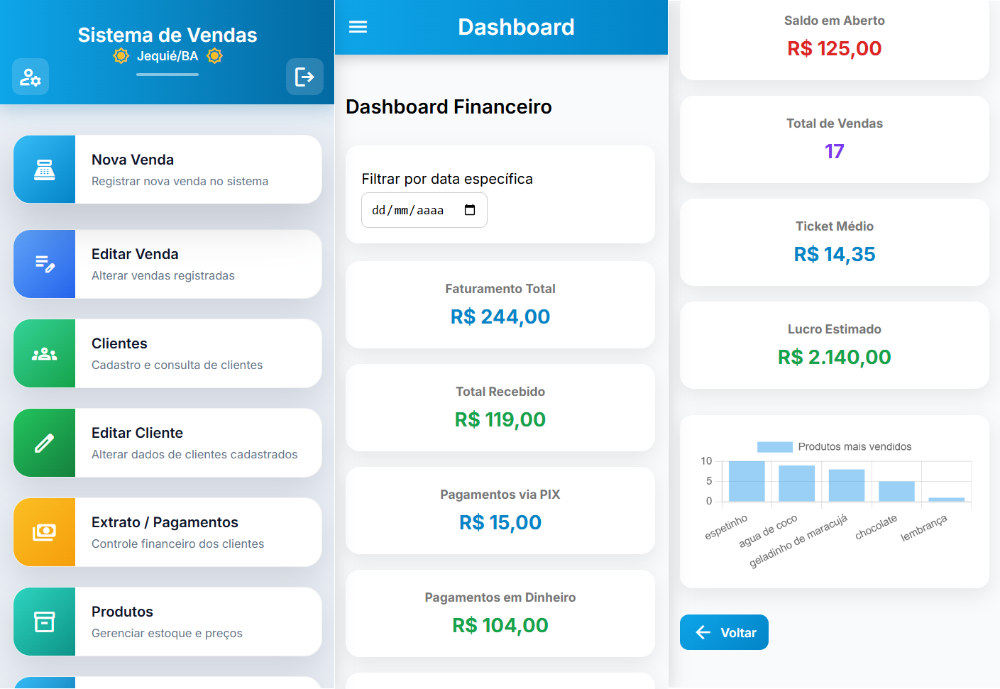
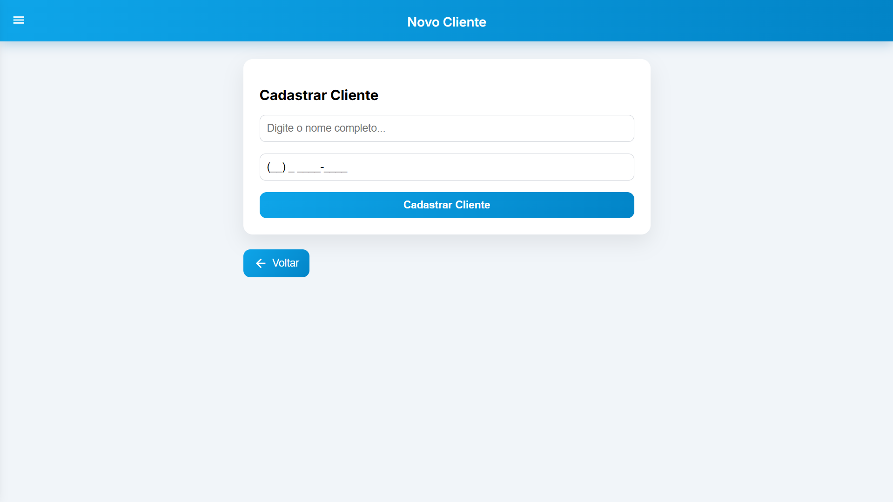
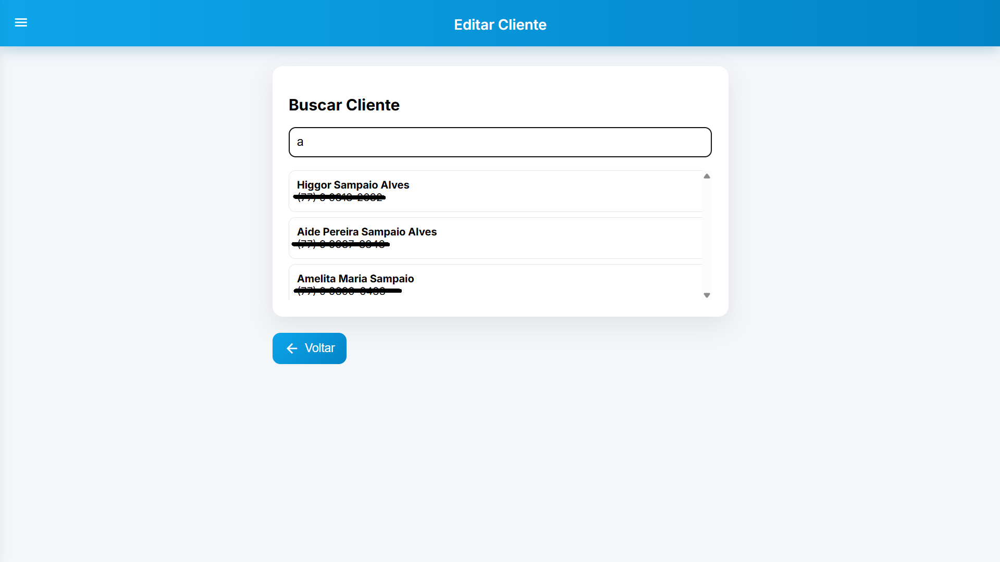
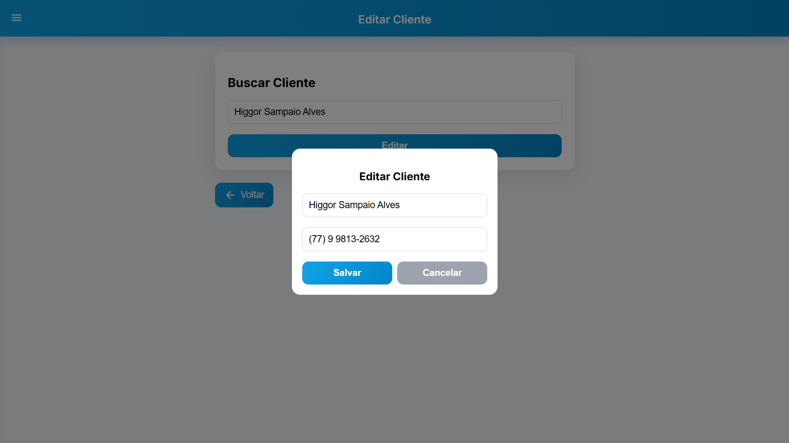
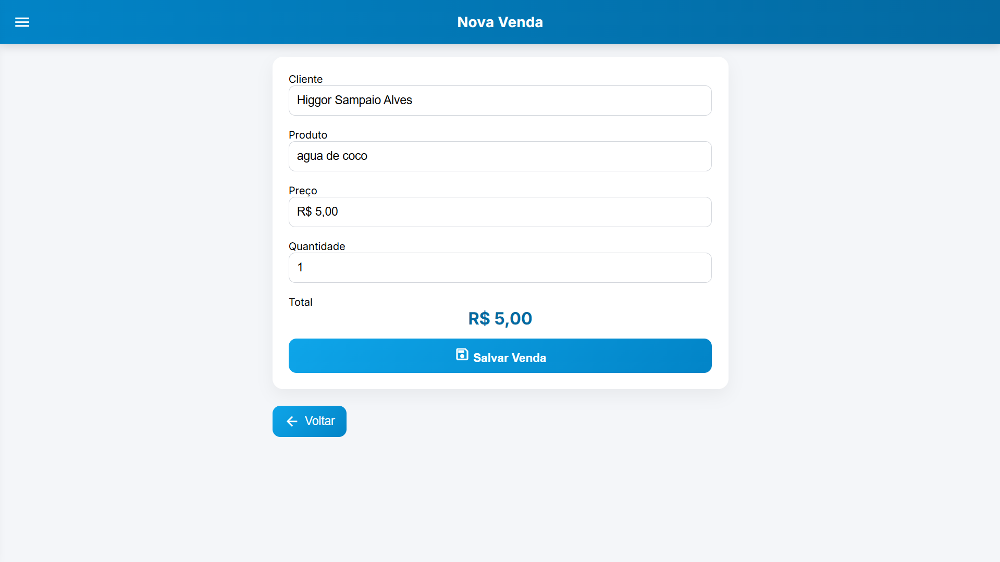
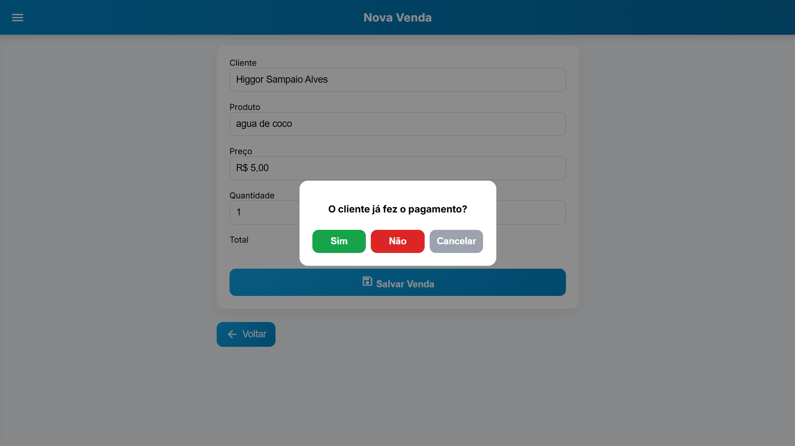
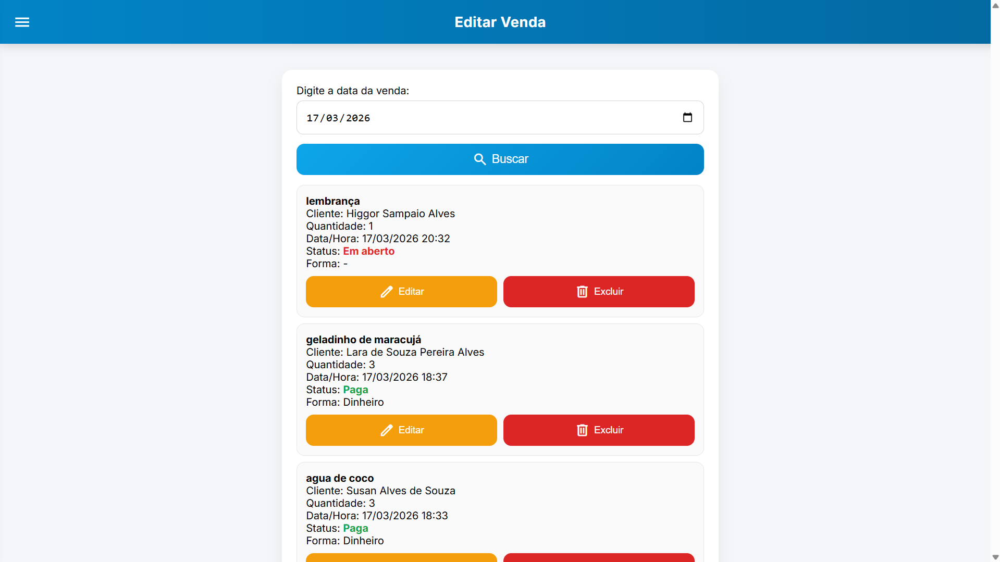

# 💻 Sistema Web de Gestão de Vendas

---

## 📌 Objetivo

Desenvolver uma aplicação web para gerenciamento de vendas, clientes e pagamentos, permitindo o controle completo de transações comerciais.

---

## 🚀 Funcionalidades

* Cadastro e edição de clientes
* Registro de vendas
* Controle de pagamentos (pago/pendente)
* Visualização de histórico de vendas
* Interface interativa com validações

---

## 🧠 Regras de Negócio

* Cliente pode ser cadastrado com telefone válido ou vazio
* Cada venda está vinculada a um cliente
* Controle de status de pagamento (pago ou pendente)
* Atualização dinâmica das informações no sistema

---

## 📸 Demonstração do Sistema

### 🏠 Tela Inicial / Dashboard

Visão geral do sistema, permitindo acesso às funcionalidades principais e visualização inicial dos dados.

---

### 👤 Cadastro de Cliente

Tela para inserção de novos clientes com validação de dados.

---

### 📋 Lista de Clientes

Visualização dos clientes cadastrados com opção de edição.

---

### ✏️ Edição de Cliente

Popup para edição de informações do cliente, com regras de validação.

---

### 💰 Registro de Venda

Tela principal de registro de vendas, vinculando cliente e valor da transação.

---

### 💳 Controle de Pagamento

Confirmação do status de pagamento no momento do registro da venda.

---

### 📊 Histórico de Vendas

Listagem das vendas registradas com status de pagamento e acompanhamento.

---

## 🛠️ Tecnologias Utilizadas

* Python
* HTML / CSS / JavaScript
* Integração com armazenamento de dados
* Git e GitHub

---

## 🎯 Aprendizados

* Desenvolvimento de aplicação web completa
* Implementação de regras de negócio reais
* Manipulação e persistência de dados
* Integração entre frontend e backend

---

## 📈 Possíveis Melhorias

* Integração com banco de dados (PostgreSQL)
* Sistema de autenticação
* Dashboard analítico de vendas
* API para integração externa

---

## 🧩 Conclusão

Este projeto é um sistema real de gestão de vendas, demonstrando capacidade de desenvolvimento completo, desde a interface até a lógica de negócio e controle de dados.
